# Product Backlog Building Canvas

 &emsp;&emsp;
O Product Backlog Building Canvas é uma ferramenta utilizada no desenvolvimento ágil de software para auxiliar na criação e refinamento do Product Backlog, que é uma lista de itens que representam requisitos, funcionalidades e melhorias desejadas para um produto. O canvas fornece uma estrutura visual para identificar e priorizar os elementos do backlog, considerando critérios como valor de negócio, riscos, complexidade e dependências, facilitando a comunicação e colaboração entre a equipe de desenvolvimento e os stakeholders.

<a href="https://app.mural.co/invitation/mural/charlesserafimmorais8192/1685913080687?sender=uf6ab60b0f576c6cf0a879828&key=4a0d91ee-5e02-4443-aba7-96d2aaefca59">Link do PBB Canvas</a>

foto do miro todo e 

### Problemas

 &emsp;&emsp;
Ao analisar o estado atual do produto, identificamos um conjunto de problemas e desafios no contexto em questão. Alguns dos principais problemas são:

### Expectativas

 &emsp;&emsp;
Ao visualizar o estado desejado do produto, listamos um conjunto de expectativas para o seu futuro, com o objetivo de alcançar resultados positivos e satisfatórios. Algumas das principais expectativas incluem:

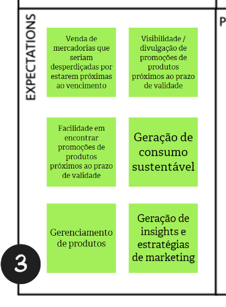

### Personas

 &emsp;&emsp;
Uma persona é uma representação fictícia de um cliente ideal ou usuário típico de um produto, serviço ou empresa. Ela nos ajuda a compreender de forma mais profunda e empática quem são os clientes, suas motivações, objetivos e desafios. Dessa forma, cada persona faz algo e espera algo do produto. Nossas personas são:

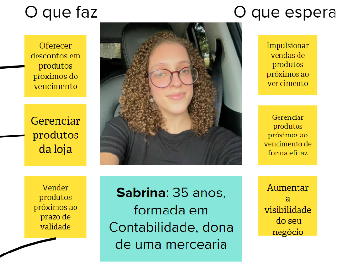
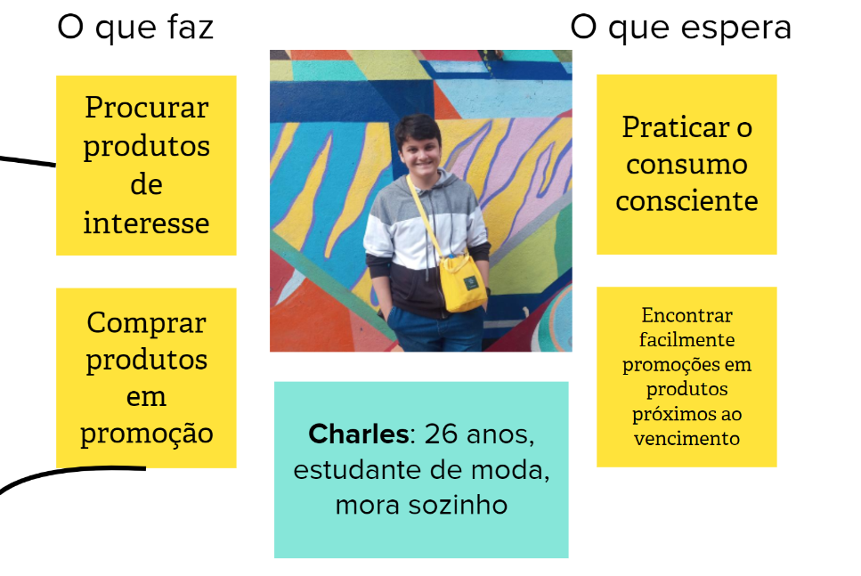

### Funcionalidades

 &emsp;&emsp;
As funcionalidades de produto referem-se às características, recursos ou ações específicas que um produto oferece aos usuários. São as capacidades e interações que um produto possui para atender às necessidades e demandas dos usuários. Algumas das nossas funcionalidades:

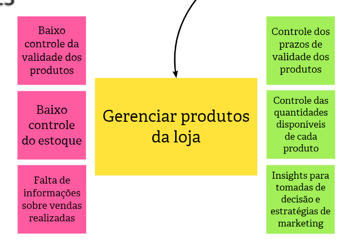
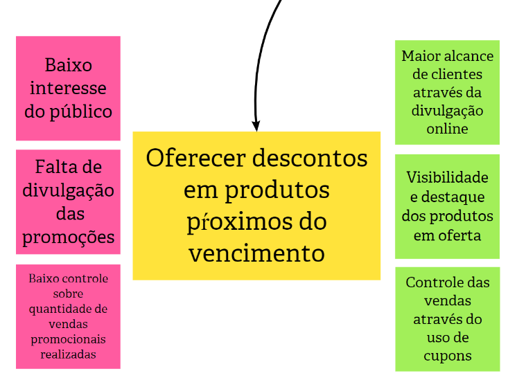
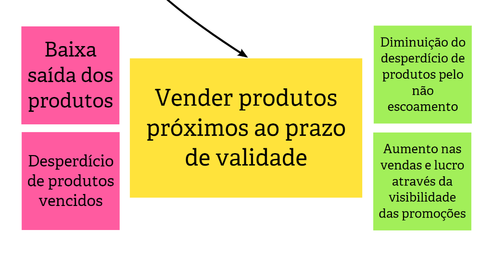
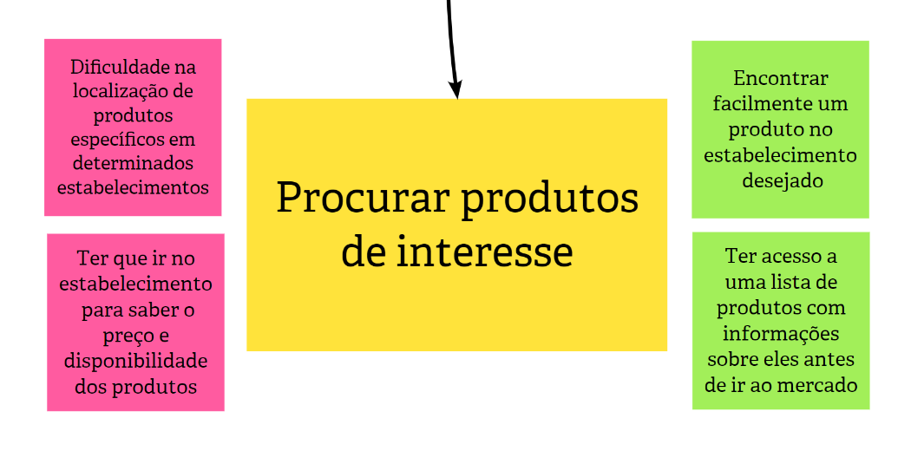
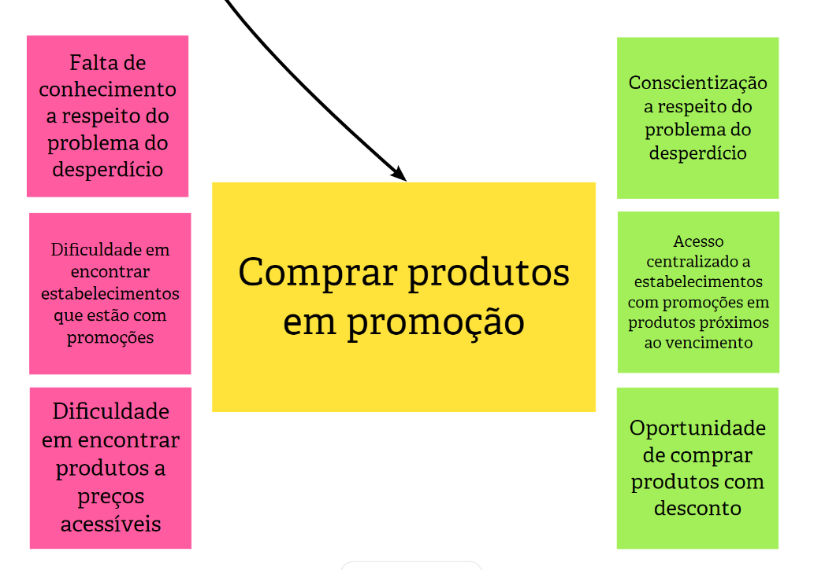

### Product Backlog Iten (PBI)

 &emsp;&emsp;
O PBI é uma unidade de trabalho ou uma descrição de uma funcionalidade específica que é adicionada ao Product Backlog de um projeto ou produto. Ele é uma descrição mais detalhada de uma funcionalidade específica que um produto deve ter. O PBI descreve o que o usuário deseja alcançar e por que essa funcionalidade é importante para o sucesso do produto. Dos PBI, escrevemos hisórias de usuários.

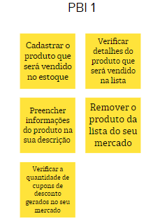

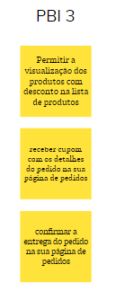
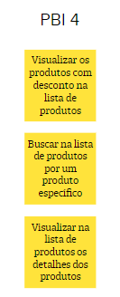
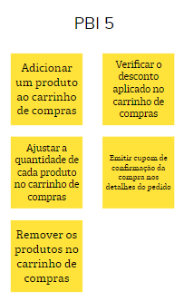

###